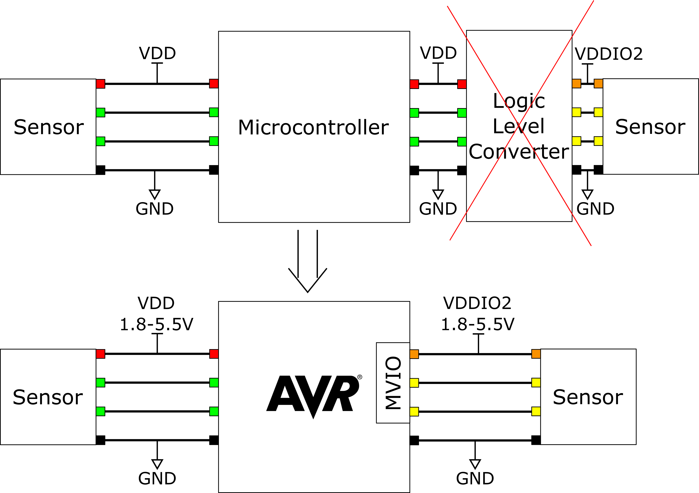

# Getting Started With Multi-Voltage Input/Output (MVIO) on AVR DB

A new feature introduced in the AVR® DB Family is the Multi-Voltage Input/Output(MVIO) peripheral. In this example, VDDIO2 supplies a different voltage level PORTC, than on the rest of the PORTs, which are supplied by VDD. It is possible to monitor this voltage level with the internal analog-to-digital converter (ADC) and also possible to get an interrupt when the voltage level for the MVIO, called VDDIO2, goes in and out of acceptable voltage range. 

These examples  how the Multi-Voltage I/O feature works on the AVR-DB family of microcontrollers. It
covers the following use cases:

* **Polling VDDIO2 Status**:
  Checking if the VDDIO2 voltage is within acceptable range by reading the Status bit.
* **Interrupt on VDDIO2 Status**:
  Make use of the interrupt that occurs when the Status bit changes state.
* **Measuring VDDIO2**:
  Use the internal ADC to measure the VDDIO2 voltage.
* **Blink a 3V LED with VDD at 1.8V**:
  Basic example of MVIO blinking an LED with forward voltage higher than VDD.
## Related Documentation

* [TBxxxx - Getting Started With MVIO](https://microchip.com/DSxxxxxxxxxx) <!--fill in DS number once it has been assigned-->
* [AVR128DB48 Curiosity Nano User Guide](https://microchip.com/DSxxxxxxxxxx) <!-- TODO: Update link once assigned -->
* [AVR128DB48 Device Page](https://www.microchip.com/wwwproducts/en/AVR128DB48)

## Software Used

* [Atmel Studio](https://www.microchip.com/mplab/avr-support/atmel-studio-7) 7.0.2397 or later
* Atmel Studio AVR-Dx_DFP version 1.2.56 or later
## Hardware Used

* [AVR128DB48 Curiosity Nano](https://www.microchip.com/DevelopmentTools/ProductDetails/PartNO/EV35L43A)
* One >15Ω resistor
* One LED with forward voltage of ~3V

## Setup

* Connect the hardware together as seen in the schematic of the [application note](https://microchip.com/DSxxxxxxxxxx) <!--fill in DS number once it has been assigned-->

## Operation
* Connect the AVR128DB48 Curiosity Nano to a computer using a USB cable
* Download the zip file or clone the example to get the source code
* Open the .atsln file with Atmel Studio
* Right-click on the project you want to run and choose "Set as StartUp Project" 
* Press *Start Without Debugging* (CTRL+ALT+F5) to run the application

## Changing Voltage
Drag and drop one of the following files to the "Curiosity" disc on your computer:
*VDD1V8.txt - Sets voltage to 1.8V
*VDD3V3.txt - Sets voltage to 3.3V

## Conclusion
After going through this example, you should have a better understanding of how to set up the MVIO peripheral to utilize the internal level shifters to communicate with and drive external components.  
